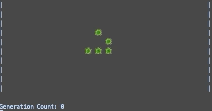

# GameOfLife

Interpretation of Conway's Game Of Life - a virtual simulation on the simplicity of the rules that constitute life. It looks something like this:

## Running the application
Once access rights to the repository have been granted you can install and run Game of Life as follows:

1. Clone the repositiory using ``git clone``
2. Navigate into the application file root directory using ``cd GameOfLife/GameOfLife/GameOfLife/``
3. Run the application using ``dotnet run Program.cs``

The simulation configuration is loaded from ``simulationConfig.json`` in the same directory. Within this, you can change the maximum generations, animation speed, grid size, starting template and rule set acting on the board.

## Authors and acknowledgment

This program was completed as part of the **Future Maker's Academy** at **MYOB** by **Braden Alsford**. 
Special thanks to **Amr Reda** and **Sumanth Nagadavalli** for their help on both the project and my professional development journey. 
